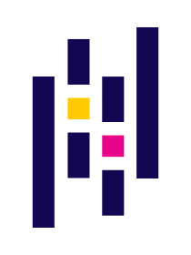

# Hello World, I'm Joffrey 

Software/Data Engineer, working @[Mediascale](https://www.serviceplan.be/).

</img></a>
</img></a>

## Get to know

Designing, improving and deploying data-oriented infrastructure, API and pipelines are my daily bread. I also play with database, data wharehouse, data lake, machine learning and computer vision systems.

-  Discovered coding years ago thanks to [Pokémon](https://pokeapi.co/)
- 🔭 Working on [MLOps pipelines](https://cloud.google.com/architecture/mlops-continuous-delivery-and-automation-pipelines-in-machine-learning) with [Detectron2](https://github.com/facebookresearch/detectron2) and [TensorRT](https://developer.nvidia.com/tensorrt)
- 🌱 Upskilling on [Data Science](https://becode.org) and [Cloud platforms](https://learn.acloud.guru/profile/joffreybvn).
- 💬 Sharing my knowledge giving Python classes and [blog posting](https://medium.com/@joffreybvn)
- 🌎 Traveling around [Colombia](https://www.youtube.com/watch?v=6YVl-aixyfs)
- 🎮 Ex-gamer, but still lurking on Twitch

⇨ [joffreybvn.be](https://joffreybvn.be/) • Discover my projects, hackathons, publications and more.

## Techs and tools:

### Cloud, ML and Big Data:

 

### Sotfware development:

  

<pre align="center">
<a href="https://joffreybvn.be">Website</a> / <a href="https://www.linkedin.com/in/joffreybvn/">Linkedin</a> / <a href="https://twitter.com/Joffreybvn">Twitter</a> / <a href="https://medium.com/@joffreybvn">Medium</a> / <a href="https://stackoverflow.com/users/7762386/joffrey-bienvenu">StackOverflow</a>
</pre>

<!--
**Joffreybvn/Joffreybvn** is a ✨ _special_ ✨ repository because its `README.md` (this file) appears on your GitHub profile.

Here are some ideas to get you started:

- 🔭 I’m currently working on a [low cost URL Shortener](oxi.cx).
- 🌱 I’m currently learning ...
- 👯 I’m looking to collaborate on ...
- 🤔 I’m looking for help with ...
- 💬 Ask me about ...
- 📫 How to reach me: ...
- 😄 Pronouns: ...
- ⚡ Fun fact: ...
-->
